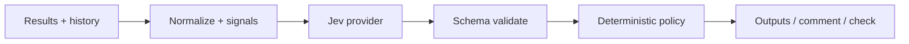

# JEV Flaky Detective

Classify failing tests as **regression**, **flaky**, **environment**, or **unknown** using typed Jev decisions. The Action never auto-reruns tests and never masks failures.

## Problem

CI failure noise wastes review time. Teams need a stable signal that separates a real regression from intermittent flakes and infrastructure issues — without silently greenwashing the build.

## How it works

1. Collect current results (JSON and/or framework reports).
2. Attach history (file and/or native GitHub Actions runs).
3. Compute deterministic signals (pass rate, flips, markers, path overlap).
4. Ask Jev for a typed `failure_type` choice.
5. Validate the response with a strict schema.
6. Apply a deterministic policy (`fail` / `warn` / `request-review` / `no-op`).
7. Emit outputs, optional PR comment, and Checks API run.



## Quick start

```yaml
- uses: JevForge/jev-flaky-detective@v0
  with:
    results_path: .jev/current-results.json
    history_path: .jev/test-history.json
    jev_provider: vercel-ai-gateway
    create_check_run: 'true'
  env:
    AI_GATEWAY_API_KEY: ${{ secrets.AI_GATEWAY_API_KEY }}
```

Pin to a major floating tag (`@v0`) or an exact SHA for strongest supply-chain guarantees.

## Decision model

| Field | Values |
| --- | --- |
| `decision` | `CLASSIFY` · `ABSTAIN` · `REQUEST_REVIEW` |
| `failure_type` | `regression` · `flaky` · `environment` · `unknown` |

**Valid Jev answers** (accepted by schema):

```json
{
  "answers": {
    "failure_type": { "type": "choice", "choice": "flaky", "confidence": 0.9 },
    "abstain": { "type": "boolean", "probability": 0.05 }
  }
}
```

**Invalid answers** (rejected):

* `choice: "rerun"` / shell text / free-form prose as the decision
* Missing `failure_type`
* `type` other than `choice` for `failure_type`

The executor only acts on enums and allowlisted side effects (comment / check run / artifacts). Explanation text is never executed.

## Jev providers

| Provider | Credential | Notes |
| --- | --- | --- |
| `vercel-ai-gateway` (default) | `AI_GATEWAY_API_KEY` | Model `typesafe-ai/jev` via AI SDK `experimental_evaluate` |
| `typesafe-native` | `TYPESAFE_API_KEY` | Requires `jev_endpoint` + `jev_model` |
| `custom-compatible` | `JEV_CUSTOM_API_KEY` | Requires HTTPS `jev_endpoint` + `jev_model` |

No silent fallback between providers. Configure via `jev_provider` input or `.jev/config.yml`.

## Inputs / outputs

See [`action.yml`](./action.yml) for the full contract. Highlights:

* **Inputs:** `results` / `results_path`, `history` / `history_path`, framework adapters (`junit_path`, `jest_path`, `playwright_path`, `vitest_path`, `mocha_path`), `fetch_github_history`, `min_confidence`, `low_confidence_policy`, `dry_run`
* **Outputs:** `decision`, `failure_type`, `classifications`, `confidence`, `reason_codes`, `evidence_summary`, counts, `provisional`, `jev_status`

## Framework adapters

| Input | Format |
| --- | --- |
| `junit_path` | JUnit XML (pytest, Surefire, …) |
| `jest_path` | Jest JSON |
| `playwright_path` | Playwright JSON |
| `vitest_path` | Vitest JSON |
| `mocha_path` | Mocha JSON |

Adapters normalize into the shared `TestResult` schema. Interfaces are stable for additional reporters.

## GitHub Actions history

Set `fetch_github_history: true` (requires `actions: read`) to pull recent workflow job/step conclusions as history evidence. This complements — does not replace — structured per-test history files.

## Data sent to Jev

Sent (bounded, redacted):

* Environment / runner labels
* Aggregate pass-rate and flip stats
* Sample of test ids, statuses, digests, marker codes, heuristic hints

Not sent:

* Provider API keys
* Full stack traces beyond a short redacted preview
* Arbitrary workflow scripts as executable instructions

## Security & permissions

Minimum permissions depend on features:

| Feature | Permission |
| --- | --- |
| Classify only | `contents: read` |
| Check run | `checks: write` |
| PR comment | `pull-requests: write` |
| Native history | `actions: read` |

See [SECURITY.md](./SECURITY.md).

## Low confidence & unavailability

When Jev is down, schema-rejected, or below `min_confidence`, `low_confidence_policy` applies:

* `fail` — fail the step, decision `ABSTAIN`
* `warn` — warn, decision `ABSTAIN` (default)
* `request-review` — neutral check, decision `REQUEST_REVIEW`
* `no-op` — continue quietly, decision `ABSTAIN`

Heuristic signals may still populate per-test classifications as provisional evidence. Failures remain visible.

## Development

```bash
npm ci
npm run typecheck
npm test
npm run build
```

Requires Node.js 24+. Consumers run the bundled `dist/index.js` (no `npm install` on the runner for dependencies).

## License

MIT © JevForge
