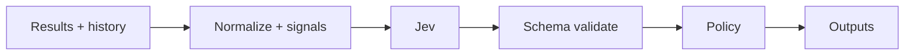

# JEV Flaky Detective

[](https://github.com/JevForge/jev-flaky-detective/releases)
[](LICENSE)
[](https://github.com/JevForge/jev-flaky-detective/actions/workflows/ci.yml)

**Classify CI test failures as regression, flaky, environment, or unknown** using [TypeSafe Jev](https://vercel.com/ai-gateway/models/jev) as a typed decision layer.

A red build is not always a product regression. This Action collects current results and history, computes deterministic signals, asks Jev for a structured `failure_type`, then applies a local policy. It **never auto-reruns tests** and **never masks failures** — classification is guidance for humans and downstream steps, not a silent greenwash.

```yaml
- id: flaky
  uses: JevForge/jev-flaky-detective@v0
  env:
    AI_GATEWAY_API_KEY: ${{ secrets.AI_GATEWAY_API_KEY }}
  with:
    junit_path: reports/**/*.xml
    history_path: .jev/test-history.json
    create_check_run: 'true'
```

Pin `@v0`, an exact tag such as `@v0.1.0`, or a commit SHA.

## Features

* Typed failure classification: `regression` · `flaky` · `environment` · `unknown`
* Jev participates via `experimental_evaluate` (not free-form text generation)
* Deterministic signals first (pass rate, flips, environment markers, path overlap)
* Framework adapters: JUnit XML, Jest, Playwright, Vitest, Mocha
* Optional native GitHub Actions history as supporting evidence
* Strict schema validation; invalid Jev answers are rejected
* Configurable low-confidence policy: `fail` · `warn` · `request-review` · `no-op`
* Structured outputs for later steps (`decision`, `failure_type`, counts, …)
* Optional Checks API run and idempotent PR comments
* Secret-based auth; credentials never go through Action inputs
* Hard guarantees: no auto-rerun, no masked failures

## How it works

```text
Test results + history
        ↓
Normalize + compute signals
        ↓
Jev proposes failure_type
        ↓
Schema validate + deterministic policy
        ↓
Action outputs (+ optional comment / check)
        ↓
Next CI/CD step
```



1. Load current results from JSON and/or framework reports.
2. Attach history from a file and/or GitHub Actions runs.
3. Compute per-test signals (pass rate, flips, markers, path overlap).
4. Call Jev through `jev_provider` (no silent provider fallback).
5. Reject invalid payloads; apply `low_confidence_policy` when needed.
6. Emit outputs. Explanation text is display-only and never executed.

## Demo

```text
CI run with a failing login test
        ↓
History shows pass → fail → pass → fail
        ↓
Jev proposes failure_type = flaky
        ↓
decision = CLASSIFY
failure_type = flaky
        ↓
Downstream step routes to flake triage
(failures remain visible — nothing was re-run or hidden)
```

## Why Jev?

Jev is the **classification judgment** layer. Heuristics alone struggle when history is thin, error text is noisy, or regression and flake signals overlap. This Action sends a redacted sample of signals to Jev, receives a typed `failure_type` choice, then lets local policy decide whether to trust it.

Jev does **not** re-run tests, delete failures, invent shell commands, or rewrite reports. If Jev is unavailable or below `min_confidence`, the result is marked `provisional` and `low_confidence_policy` applies — the Action never pretends a confident AI decision happened.

## Quick Start

1. Produce a test report in the workspace (for example JUnit XML or normalized JSON).
2. Add repository secret `AI_GATEWAY_API_KEY` (default Jev provider).
3. Add a workflow step:

```yaml
name: Classify failures
on:
  workflow_run:
    workflows: [CI]
    types: [completed]

permissions:
  contents: read
  checks: write
  actions: read

jobs:
  classify:
    runs-on: ubuntu-latest
    steps:
      - uses: actions/checkout@v4

      - id: flaky
        uses: JevForge/jev-flaky-detective@v0
        env:
          AI_GATEWAY_API_KEY: ${{ secrets.AI_GATEWAY_API_KEY }}
        with:
          junit_path: reports/**/*.xml
          history_path: .jev/test-history.json
          create_check_run: 'true'

      - name: Print classification
        if: always()
        run: |
          echo "decision=${{ steps.flaky.outputs.decision }}"
          echo "failure_type=${{ steps.flaky.outputs.failure_type }}"
          echo "flaky_count=${{ steps.flaky.outputs.flaky_count }}"
```

## Complete Example

Use the classification to drive triage without hiding the red build:

```yaml
name: Test and classify
on:
  pull_request:

permissions:
  contents: read
  checks: write
  pull-requests: write
  actions: read

jobs:
  test:
    runs-on: ubuntu-latest
    steps:
      - uses: actions/checkout@v4
      - run: npm test -- --reporter=junit --outputFile=reports/junit.xml
        continue-on-error: true

      - id: flaky
        if: always()
        uses: JevForge/jev-flaky-detective@v0
        env:
          AI_GATEWAY_API_KEY: ${{ secrets.AI_GATEWAY_API_KEY }}
        with:
          junit_path: reports/**/*.xml
          history_path: .jev/test-history.json
          comment_on_github: 'true'
          create_check_run: 'true'
          low_confidence_policy: warn

      - name: Open flake triage path
        if: always() && steps.flaky.outputs.failure_type == 'flaky'
        run: echo "Primary signal looks flaky — route to flake owners"

      - name: Flag likely regression
        if: always() && steps.flaky.outputs.failure_type == 'regression'
        run: echo "Primary signal looks like a regression — prioritize authors"

      - name: Flag environment issues
        if: always() && steps.flaky.outputs.failure_type == 'environment'
        run: echo "Primary signal looks environmental — check runners/services"
```

More workflows: [`examples/basic.yml`](examples/basic.yml), [`examples/with-junit.yml`](examples/with-junit.yml), [`examples/with-github-history.yml`](examples/with-github-history.yml), [`examples/pr-classify.yml`](examples/pr-classify.yml).

## Inputs

| Input | Required | Default | Description |
| --- | --- | --- | --- |
| `results` | no | — | Inline JSON of current test results (`TestResult[]` or `{ results }`) |
| `results_path` | no | — | Path(s) or glob to normalized results JSON |
| `history` | no | — | Inline JSON of historical runs (`HistoryRun[]` or `{ runs }`) |
| `history_path` | no | `.jev/test-history.json` | Workspace JSON of historical runs |
| `test_id` | no | — | Classify a single test id / name |
| `failing_only` | no | `true` | Only classify currently failing tests when any failed |
| `environment` | no | `ci` | `production` \| `staging` \| `development` \| `test` \| `ci` \| `unknown` |
| `runner_os` | no | — | Optional OS label for environment evidence |
| `runner_arch` | no | — | Optional architecture label |
| `changed_paths` | no | — | JSON array or newline list of changed paths (regression evidence) |
| `junit_path` | no | — | Path(s) or glob to JUnit XML |
| `jest_path` | no | — | Path(s) or glob to Jest JSON |
| `playwright_path` | no | — | Path(s) or glob to Playwright JSON |
| `vitest_path` | no | — | Path(s) or glob to Vitest JSON |
| `mocha_path` | no | — | Path(s) or glob to Mocha JSON |
| `fetch_github_history` | no | `false` | Fetch recent Actions job/step conclusions |
| `history_lookback` | no | `20` | Max historical runs to consider (`1`–`50`) |
| `history_branch` | no | — | Limit GitHub history to this branch |
| `workflow_name` | no | — | Optional workflow name filter for GitHub history |
| `min_confidence` | no | `0.7` | Minimum Jev confidence to trust `CLASSIFY` |
| `low_confidence_policy` | no | `warn` | `fail` \| `warn` \| `request-review` \| `no-op` |
| `source_error_policy` | no | `warn` | `fail` \| `warn` when a configured source cannot be read |
| `jev_provider` | no | `vercel-ai-gateway` | `vercel-ai-gateway` \| `typesafe-native` \| `custom-compatible` |
| `jev_endpoint` | no | — | HTTPS evaluate endpoint (`custom-compatible`; optional for native) |
| `jev_model` | no | — | Catalog model id (native / custom). Gateway default: `typesafe-ai/jev` |
| `jev_config_path` | no | `.jev/config.yml` | Shared Jev config path |
| `timeout_ms` | no | `45000` | Remote Jev call timeout |
| `max_tests` | no | `500` | Max tests preserved after merge |
| `max_tests_to_jev` | no | `25` | Sample size sent to Jev |
| `comment_on_github` | no | `false` | Post or update an idempotent PR/issue summary comment |
| `create_check_run` | no | `true` | Create a completed Checks API run |
| `write_report_artifact` | no | `false` | Write markdown/JSON reports under `.jev/` |
| `structured_logs` | no | `false` | Emit a single JSON summary log line |
| `dry_run` | no | `false` | Skip comments and check runs; still emit outputs |
| `trust_repo_jev_endpoint` | no | `false` | Allow `jev_endpoint` from repo config to receive credentials |
| `github_token` | no | `${{ github.token }}` | Token for comments, checks, optional Actions history |

Paths must stay inside `GITHUB_WORKSPACE`. Provider credentials belong in `env`, not in `with:`.

## Outputs

| Output | Description |
| --- | --- |
| `decision` | `CLASSIFY` \| `ABSTAIN` \| `REQUEST_REVIEW` |
| `failure_type` | Primary type: `regression` \| `flaky` \| `environment` \| `unknown` |
| `classifications` | JSON array of per-test classifications |
| `classifications_file` | Workspace file when the classifications output would be too large |
| `confidence` | `0`–`1` (or `0` when Jev did not evaluate) |
| `reason_codes` | JSON array of stable reason codes |
| `evidence_summary` | JSON aggregate signals |
| `provisional` | `true` when the result is not a confident Jev evaluation |
| `jev_status` | `evaluated` \| `unavailable` \| `schema_rejected` |
| `jev_proposed` | Jev choice, or empty when Jev did not evaluate |
| `needs_review` | `true` when request-review policy applied |
| `tests_count` | Tests considered after filtering |
| `failing_count` | Currently failing tests |
| `flaky_count` / `regression_count` / `environment_count` / `unknown_count` | Per-type counts |
| `summary` | One-line decision summary |
| `check_status` | `created` \| `dry-run` \| `skipped` |
| `report_markdown_file` / `report_json_file` | Artifact paths when enabled |
| `jev_provider` | Provider that was asked (never silently swapped) |

### Using outputs in conditions

```yaml
- name: Triage flakes
  if: steps.flaky.outputs.failure_type == 'flaky'

- name: Escalate regressions
  if: steps.flaky.outputs.failure_type == 'regression'

- name: Investigate runners
  if: steps.flaky.outputs.failure_type == 'environment'

- name: Require human review
  if: steps.flaky.outputs.decision == 'REQUEST_REVIEW' || steps.flaky.outputs.needs_review == 'true'
  run: echo "Classification is provisional — review required"

- name: Parse classifications
  if: always()
  run: echo '${{ steps.flaky.outputs.classifications }}' | jq '.[0].failure_type'
```

Use `if: always()` when the classify step must run (or be read) after a failing test step.

## Authentication

Create secrets under **Settings → Secrets and variables → Actions → New repository secret**.

| Secret | When |
| --- | --- |
| `AI_GATEWAY_API_KEY` | Default `jev_provider: vercel-ai-gateway` |
| `TYPESAFE_API_KEY` | `jev_provider: typesafe-native` |
| `JEV_CUSTOM_API_KEY` | `jev_provider: custom-compatible` |

```yaml
env:
  AI_GATEWAY_API_KEY: ${{ secrets.AI_GATEWAY_API_KEY }}
```

Do not put API keys in `with:`. Providers never fall back to each other.

## Permissions

Minimum for local reports only:

```yaml
permissions:
  contents: read
```

| Extra permission | When |
| --- | --- |
| `checks: write` | `create_check_run: true` (default) |
| `pull-requests: write` | `comment_on_github: true` |
| `actions: read` | `fetch_github_history: true` |

## Decision model

| Field | Values |
| --- | --- |
| `decision` | `CLASSIFY` · `ABSTAIN` · `REQUEST_REVIEW` |
| `failure_type` | `regression` · `flaky` · `environment` · `unknown` |

| `low_confidence_policy` | Behavior |
| --- | --- |
| `fail` | Decision `ABSTAIN`, step fails |
| `warn` | Decision `ABSTAIN`, warning (default) |
| `request-review` | Decision `REQUEST_REVIEW`, neutral check |
| `no-op` | Decision `ABSTAIN`, continue quietly |

Hard guarantees encoded as reason codes: `NEVER_RERUN`, `NEVER_MASK`.

Contract details: [docs/decision-contract.md](docs/decision-contract.md). Adapter formats: [docs/adapters.md](docs/adapters.md).

## Framework adapters

| Input | Format |
| --- | --- |
| `junit_path` | JUnit XML (pytest, Surefire, …) |
| `jest_path` | Jest JSON |
| `playwright_path` | Playwright JSON |
| `vitest_path` | Vitest JSON |
| `mocha_path` | Mocha JSON |

All adapters normalize into the shared `TestResult` schema.

## Data sent to Jev

Sent (bounded, redacted):

* Environment / runner labels
* Aggregate pass-rate and flip stats
* Sample of test ids, statuses, error digests, marker codes, heuristic hints

Not sent:

* Provider API keys
* Full unbounded stack traces
* Arbitrary workflow scripts as executable instructions

Gateway requests use zero data retention. Custom endpoints must be public HTTPS.

## Configuration

Optional `.jev/config.yml` can set provider defaults. Workflow inputs win when set. See [`examples/.jev/config.yml`](examples/.jev/config.yml).

```yaml
jev_provider: vercel-ai-gateway
min_confidence: 0.7
low_confidence_policy: warn
```

## Troubleshooting

| Signal | Meaning |
| --- | --- |
| `JEV_UNAVAILABLE` + `provisional: true` | Missing credential, timeout, or HTTP error for the selected provider |
| `SCHEMA_REJECTED` | Jev returned an invalid choice; policy applies |
| `SOURCE_UNAVAILABLE` | Missing report, path escaped workspace, or history fetch failed |
| `HISTORY_EMPTY` | No historical runs available for signals |
| `NEVER_RERUN` / `NEVER_MASK` | Always present — Action does not re-run or hide failures |

## Security

* Secrets are redacted before Jev and log summaries
* Report paths are confined to the workspace
* Jev explanation text is never executed as a command, path, or GitHub operation
* Allowed side effects: set outputs, fail/warn the step, optional comment / check run / artifacts
* No silent fallback between Jev providers

See [SECURITY.md](SECURITY.md).

## Versioning

```yaml
uses: JevForge/jev-flaky-detective@v0      # floating major
uses: JevForge/jev-flaky-detective@v0.1.0 # exact release
```

Prefer an exact tag or commit SHA for production workflows.

## Development

```bash
npm ci
npm test
npm run typecheck
npm run build
# or
npm run all
```

Node.js 24+. Consumers run `dist/index.js` and do not need `npm install`. Rebuild and commit `dist/` when the entrypoint changes.

## Contributing

See [CONTRIBUTING.md](CONTRIBUTING.md). Bug and feature templates live under `.github/ISSUE_TEMPLATE/`.

## License

MIT — [LICENSE](LICENSE).
